# 📘 Manual Técnico y Guía Operativa: Certificados SSL/TLS y Periféricos
### **IDA System — Ecosistema de Impresión Térmica, Básculas y Dispositivos Móviles**

---

## 📌 1. Introducción y Arquitectura

Este manual documenta la arquitectura de seguridad, la emisión de certificados criptográficos X.509 y la configuración de confianza en dispositivos para el subsistema de hardware y periféricos de **IDA System** (impresoras térmicas ESC/POS, básculas de pesaje, comanderos y terminales de punto de venta).

```mermaid
graph TD
    subgraph "Modo 1: Flujo Estándar en la Nube (99% de los casos — Sin Certificados en Tablets)"
        T1["📱 Tablet / Celular Comandero"] -->|HTTPS Normal a la Nube| B1["☁️ Backend IDA (ida.analiticasoft.com)"]
        B1 -->|WebSocket Seguro con Token HMAC| D1["⚡ IDA Print Driver (PC de Caja)"]
        D1 -->|Comandos ESC/POS Raw TCP:9100| P1["🖨️ Impresoras (Cocina / Barra / Caja)"]
    end

    subgraph "Modo 2: Flujo LAN Directo / Dispositivos Antiguos (Con Certificado Raíz)"
        T2["💻 Dispositivo Legacy / Tablet LAN"] -->|HTTPS / WSS Seguro con Certificado Local| D2["⚡ IDA Print Driver (Puerto 8787 Seguro)"]
        D2 -->|Comandos ESC/POS Raw TCP:9100| P2["🖨️ Impresoras Térmicas"]
    end
```



---

## 🗂️ 2. Estructura de Archivos en `driver/certs/`

| Archivo | Tipo | Descripción |
| :--- | :--- | :--- |
| **`ida_ca_root.crt`** | Certificado Público | **Certificado de Autoridad Raíz (IDA Root CA)**. Este es el archivo público que se instala en tablets o PCs para que confíen en el sistema. Válido por 10 años. |
| **`ida_ca_root.key`** | Clave Privada | Clave privada de la CA Raíz. **Confidencial**, se usa únicamente para firmar nuevos certificados. |
| **`ida_peripheral.crt`** | Certificado Público | Certificado del servidor local / driver con extensiones SAN para `localhost` y la red LAN. |
| **`ida_peripheral.key`** | Clave Privada | Clave privada RSA de 2048 bits del servidor local del driver. |
| **`ida_fullchain.crt`** | Cadena Completa | Unión del certificado de servidor + certificado raíz. Utilizado por servidores HTTPS/WSS. |
| **`instalar_en_windows.bat`**| Script Windows | Instalador en 1 clic que registra la CA en el almacén de confianza de Windows (`ROOT`). |
| **`instalar_en_linux.sh`** | Script Linux | Instalador automático para Ubuntu, Debian, Arch y Raspberry Pi OS. |
| **`openssl_san.cnf`** | Configuración | Plantilla de OpenSSL con la lista de dominios e IPs permitidas (*Subject Alternative Names*). |

---

## 🚀 3. Los 2 Modos de Operación

### 🌐 Modo 1: Estándar / Por Defecto (Recomendado)
* **¿Cuándo se usa?**: Siempre que los comanderos y tablets operen normalmente conectándose al dominio de IDA (`https://...`).
* **Instalación requerida en tablets**: **NINGUNA**.
* **Cómo funciona**: La tablet envía la orden a la nube. El backend emite la comanda vía WebSocket al driver instalado en la caja local, y el driver la despacha por cable o red local a las impresoras. Cero bloqueos de navegador y cero mantenimiento.

---

### 🛡️ Modo 2: Local Directo / Dispositivos Heredados
* **¿Cuándo se usa?**: 
  1. Cuando se opera en terminales con sistemas operativos antiguos (Windows 7 / POS viejos).
  2. Cuando una tablet se comunica directamente a una IP local de la caja (`https://192.168.1.X:8787`) sin pasar por internet.
* **Instalación requerida**: Instalar el certificado raíz `ida_ca_root.crt` en el dispositivo siguiendo las guías de la siguiente sección.

---

## 📲 4. Guías de Instalación Paso a Paso

### 🤖 A. En Tablets Android (Samsung, Lenovo, Xiaomi, Huawei, etc.)
1. Envía o copia el archivo `ida_ca_root.crt` a la tablet (vía correo, WhatsApp Web, descarga o cable USB).
2. En la tablet, entra a **Ajustes** (Configuración).
3. Dirígete a **Seguridad y privacidad** (o *Bloqueo y seguridad*).
4. Toca en **Más ajustes de seguridad** -> **Encriptación y credenciales** (o *Instalar desde almacenamiento*).
5. Selecciona **Instalar un certificado** -> **Certificado de CA**.
6. Si aparece una advertencia sobre la privacidad, pulsa **"Instalar de todos modos"**.
7. Selecciona el archivo `ida_ca_root.crt`.
8. En nombre del certificado escribe: `IDA System Root CA` y guarda los cambios.
9. *Listo: El navegador Chrome en la tablet considerará las conexiones locales 100% seguras.*

---

### 🍏 B. En iPads y iPhones (iOS / iPadOS)
1. Abre el archivo `ida_ca_root.crt` desde el navegador **Safari** en el iPad.
2. Safari mostrará un aviso: *"Este sitio web está intentando descargar un perfil de configuración"*. Pulsa **Permitir**.
3. Abre **Ajustes** en el iPad.
4. En la parte superior aparecerá la opción **Perfil descargado**; tócala y selecciona **Instalar** (introduce el PIN del iPad).
5. Ve a **Ajustes** -> **General** -> **Información** -> **Ajustes de confianza de certificados** (al final de la pantalla).
6. En *"Confiar plenamente en los certificados raíz"*, activa el interruptor de **IDA System Root CA**.
7. *Listo: Safari y Chrome en el iPad aceptarán la conexión sin alertas.*

---

### 💻 C. En Computadoras de Caja (Windows)

#### Método Automático (1 Clic):
1. Haz clic derecho sobre el archivo `driver/certs/instalar_en_windows.bat`.
2. Selecciona **"Ejecutar como Administrador"**.
3. El script ejecutará:
   ```cmd
   certutil -addstore -f "ROOT" ida_ca_root.crt
   ```
4. Verás el mensaje `[EXITO] Certificado Raiz instalado correctamente`.

#### Método Manual:
1. Presiona `Win + R`, escribe `certmgr.msc` y presiona Enter.
2. Expande **Entidades de certificación raíz de confianza** -> clic derecho en **Certificados** -> **Todas las tareas** -> **Importar...**
3. Selecciona `ida_ca_root.crt` y completa el asistente.

---

### 🐧 D. En Servidores y Cajas Linux / Raspberry Pi
Ejecuta con privilegios de superusuario:
```bash
sudo bash driver/certs/instalar_en_linux.sh
```
O de forma manual:
```bash
sudo cp driver/certs/ida_ca_root.crt /usr/local/share/ca-certificates/ida_ca_root.crt
sudo update-ca-certificates
```

---

## 🔄 5. Cómo Regenerar Certificados para una Nueva Red Local (LAN)

Si el restaurante o tienda cambia de segmento de red (por ejemplo de `192.168.1.X` a `192.168.0.X` o `10.0.0.X`):

1. Abre una terminal en la carpeta del proyecto.
2. Ejecuta el script generador:
   ```bash
   bash driver/scripts/generate_certs.sh
   ```
3. El script detectará automáticamente la nueva IP local de la máquina y generará los nuevos certificados firmados con soporte para las nuevas IPs manteniendo la misma CA Raíz.

---

## 🛠️ 6. Solución de Problemas Frecuentes (Troubleshooting)

### ❓ 1. El navegador en la tablet dice *"Su conexión no es privada"* (`NET::ERR_CERT_AUTHORITY_INVALID`)
* **Causa**: No se instaló el certificado raíz `ida_ca_root.crt` en la tablet o no se activó la confianza total (en iOS).
* **Solución**: Sigue el paso a paso de la Sección 4 para instalar el certificado de CA en el dispositivo, o utiliza el **Modo 1 (Cloud Printing)** que no requiere certificados locales.

---

### ❓ 2. El navegador muestra error `ERR_CERT_COMMON_NAME_INVALID`
* **Causa**: La IP local de la computadora donde corre el driver cambió y no coincide con las registradas en el certificado SAN.
* **Solución**: Ejecuta `bash driver/scripts/generate_certs.sh` para actualizar la lista de IPs autorizadas.

---

### ❓ 3. La comanda se guarda en el sistema pero no se imprime el ticket
* **Verificación**:
  1. Verifica que el Agente de Impresión esté en ejecución:
     ```bash
     cd driver && node agente.js
     ```
  2. Verifica que las IPs de las impresoras en `config_ida.json` correspondan a las impresoras físicas en la red (puerto 9100).
  3. Comprueba el estado de salud entrando a: `http://localhost:8787/health` o `https://localhost:8787/health`.

---

## 🔒 7. Seguridad Criptográfica y Token HMAC (`X-Print-Token`)

Para evitar que dispositivos no autorizados envíen impresiones falsas a la red:
* Toda comunicación entre el Backend y el Driver viaja cifrada con el encabezado de autenticación **`X-Print-Token`**.
* El token se calcula criptográficamente mediante HMAC SHA-256 utilizando la clave secreta `PRINT_DRIVER_TOKEN`:
  $$\text{PrintToken} = \text{HMAC-SHA256}(\text{Key}, \text{"print-driver:"} + \text{tenantId})$$
* El backend y el driver rechazan de inmediato cualquier orden sin una firma HMAC válida.

---

> **Documento certificado para el equipo técnico de AnalíticaSoft y soporte de IDA System.**  
> *Versión 1.0 — Compatible con estándares X.509, TLS 1.2 / 1.3 y ESC/POS Thermal Protocol.*
